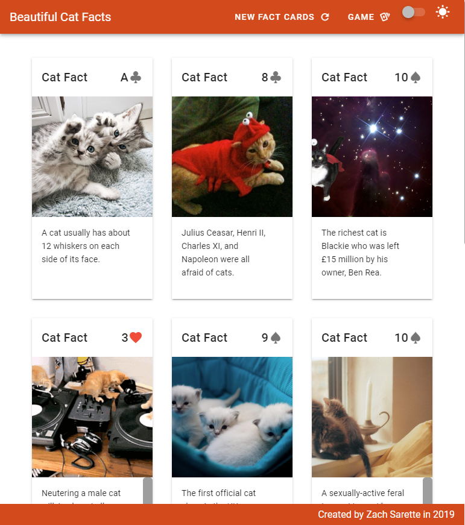
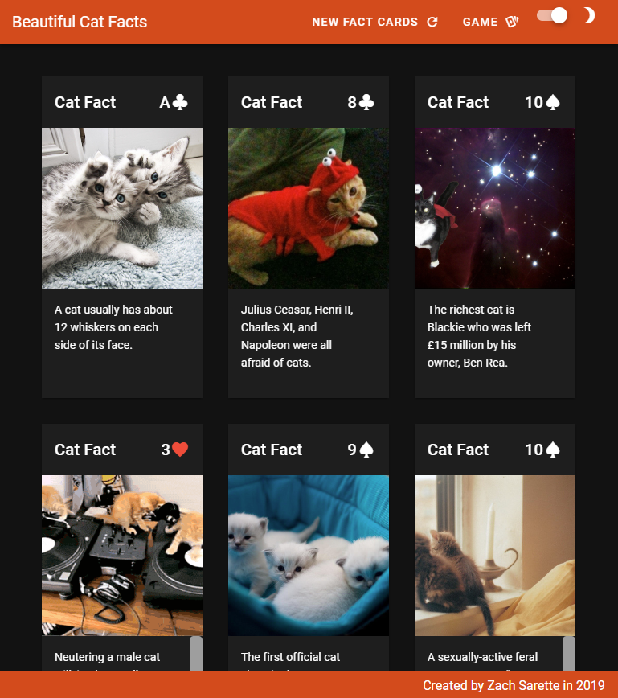

# beautiful-cat-facts

## Welcome To Beautiful Catfacts

> A toy Vue JS app that displays randomized cat facts and pictures.


| __Desktop Light Mode__ | __Desktop Dark Mode__ |
| --- | --- |
|  |  |

| __Mobile Light Mode__ | __Mobile Dark Mode__ |
| --- | --- |
|  |  |


## Project setup

If you'd like to look at the code and use it yourself,
make sure to fork and clone it first. 

Also, be sure to use the latest version of npm and node.

## Install dependencies. 
```
npm install
```

### Compiles and hot-reloads for development
```
npm run serve
```

### Compiles and minifies for production
```
npm run build
```
### Running the build locally

If you'd like to run the build locally, you can easily use the Node.js static file server.
```
npm install -g serve
# -s flag means serve it in Single-Page Application mode
serve -s dist
```
For more instructions on deployment, check out the [excellent docs here](https://cli.vuejs.org/guide/deployment.html#previewing-locally).


### Lints and fixes files
```
npm run lint
```

### Customize configuration
See [Configuration Reference](https://cli.vuejs.org/config/).

### Author
Zach Sarette
- Twitter: [@SuperRocketZach](https://twitter.com/SuperRocketZach)
- Github: [@zacharysarette](https://github.com/zacharysarette)
